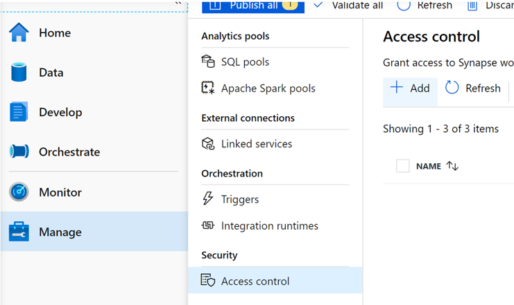
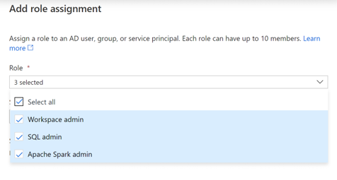
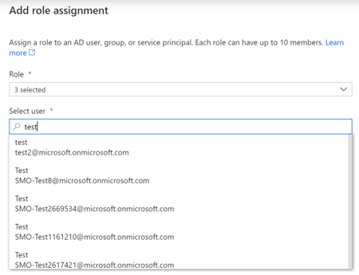
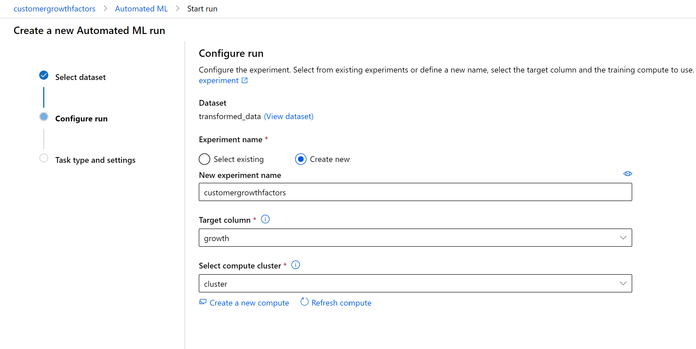
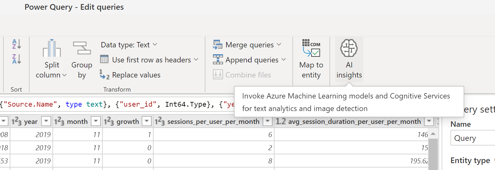
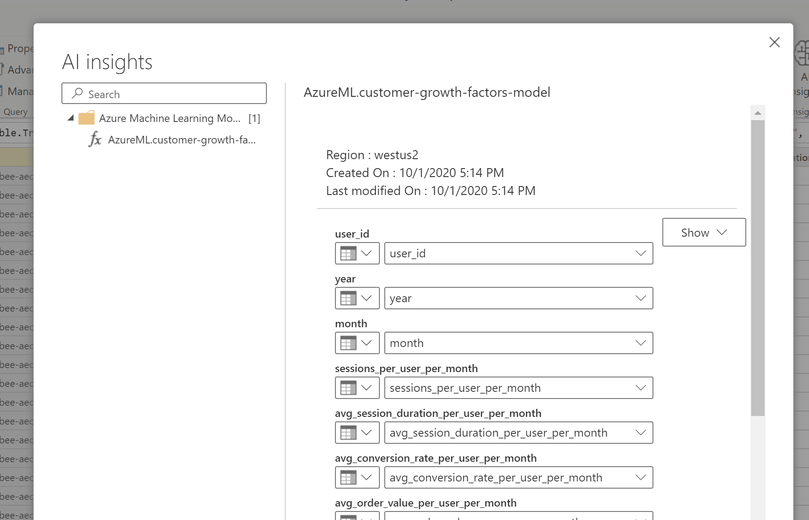

# Deployment Guide  
  
We are currently working on an automated deployment process for this solution accelerator. Until this becomes available, here is the Manual Deployment Guide for deploying this Solution Accelerator.  

## Step 1: Get the data required for this Accelerator 
We are using the data provided by [this Kaggle Open Dataset](https://www.kaggle.com/mkechinov/ecommerce-behavior-data-from-multi-category-store), and you will need to download the data to your local machine. You will need the following CSVs/Datasets (download them):  
    - 2019-Oct.csv  
    - 2019-Nov.csv  
    - 2019-Dec.csv.gz (available [here](https://drive.google.com/drive/folders/1Nan8X33H8xrXS5XhCKZmSpClFTCJsSpE))   
    - 2020-Jan.csv.gz (available [here](https://drive.google.com/drive/folders/1Nan8X33H8xrXS5XhCKZmSpClFTCJsSpE))
    - 2020-Feb.csv.gz (available [here](https://drive.google.com/drive/folders/1Nan8X33H8xrXS5XhCKZmSpClFTCJsSpE))  
    - 2020-Mar.csv.gz (available [here](https://drive.google.com/drive/folders/1Nan8X33H8xrXS5XhCKZmSpClFTCJsSpE))
    - 2020-Apr.csv.gz (available [here](https://drive.google.com/drive/folders/1Nan8X33H8xrXS5XhCKZmSpClFTCJsSpE))  

## Step 2: Create Azure Synapse Analytics (workspace preview)
In this step you will deploy an Azure Synapse Analytics (workspace preview), a Spark Pool in the Azure Synapse Analytics (workspace preview) and an Azure Data Lake (Gen2) Storage Account into your Azure Subscription that you are using for this solution accelerator. 
1. Go to the Azure Portal and deploy an Azure Synapse Analytics (workspace preview) resource into the resource group that you are using for this Solution Accelerator.  
    - You can search for `Azure Synapse Analytics (workspaces preview)` after clicking on `Create a resource` to get the correct resource.
    - Select your Azure subscription and resource group and provide a unique name for the workspace. Click on "Create new" to set up a new Data Lake Storage Gen2 account to use for this accelerator.

## Step 3: Upload Data to Synapse Workspace
In this step you will upload the dataset to Azure Data Lake Gen2 so that it can be accessed in Synapse. File upload is available by downloading the Azure Storage Explorer application or using AzCopy.
1. Open the Microsoft Azure Storage Explorer application
2. Connect to your Azure account
3. In the Explorer, expand your subscription and find the ADLS Gen2 Storage Account that you deployed in Step 2
4. Expand "Blob containers" and click on the container
5. Create a folder named `raw_data`
6. Upload the Kaggle dataset into this folder

## Step 3: Create an Azure Machine Learning Workspace
1. Go to the Azure Portal and deploy a Azure Machine Learning Services resource into the resource group that you are using for this Solution Accelerator.  
    - You can search for `Machine Learning` after clicking on `Create a resource` to get the correct resource.  
    - **NOTE**: Along with the service comes the following:  
        - Azure Key Vault  
        - Azure Storage  
        - Azure Application Insights  
        - Azure Container Registry

## Step 4: Upload Notebooks to the Synapse Workspace  
1. Launch Synapse Studio:  
    - Go to the resource page in the portal and click the "Launch Synapse Studio" button
2. Go to "Develop", click the "+", and click Import:  
    - In the demo's repository, go to `1. Analytics Deployment\synapse-studio\notebooks` to select all of the the Spark Notebooks  
3. Click Publish and confirm the assets to be published  
4. Go to the "Manage" tab in the Studio and click on the Apache Spark pools  
5. Click on the Spark Pool that you deployed and click "Packages", then click "Upload environment config file"  
    - Go to `1. Analytics Deployment\synapse-studio\cluster_config` to get the requirements.txt for upload  
6. Ensure that you give yourself and any other user admin privilages for this accelerator by going to the `Manage` tab, then `Access control` underneath `Security` and click "+ Add"
    -   
7. Now click the Role dropdown and select all three roles, and search for your username and the other user's usernames to be added by using the search bar underneath the Role dropdown  
    -   
    -   
8. Click Apply at the bottom of the window  
9. Now the environment should be ready to go for the execution of the scripts  
  
## Step 5: Running of the Notebooks and SQL Scripts  
1. Configure / Fill out the Parameters and then Run the following notebooks and scripts in order:  
    1. `1 - Clean Data`  
    2. `2 - Data Engineering`  
    3. `3 - Feature Engineering`  
    4. `4 - ML Model Building` 
2. After all of these have been run successfully, you will have a Spark-based machine learning model and the top revenue growth factors

## Step 6: Set Up Batch Scoring via Synapse Orchestration Pipeline
1. In Synapse Studio, go to "Orchestrate", click the "+", and choose Pipeline
2. In the Properties window, change the pipeline name to "Daily Orchestration"
3. Click the "{}" button at the top right corner to open the Code window
4. Copy and paste the contents of `1. Analytics Deployment\synapse_studio\pipelines\Daily Orchestration.json`
5. Click OK to apply. The final pipeline should look like:
    - 
6. Add a scheduled trigger to run the pipeline on a daily basis
7. Click Publish all

## Step 7: Automate the Machine Learning Process with Azure Machine Learning and Deploy the Model to ACI
1. Launch Azure Machine Learning Studio: 
    - Go to the resource page in the portal and click the "Launch studio" button
2. Create a Compute cluster by going to "Compute > Compute clusters > New"
2. Register your data store by going to "Datastores > New Datastore"
    - Entering your Data Lake connection details in the pop-up pane, selecting Azure Blob Storage
3. Register a new dataset by going to "Datasets > Create Dataset > From datastore"
    - In Basic info, enter your dataset name and choose Tabular for dataset type
    - In Datastore selection, click on your previously created datastore and click "Select datastore", then type `transformed_data/ml_data_parquet/**` into the Path box
    - In Settings and preview, verify that the data shows accurately in Parquet format
    - Validate the schema, confirm details, and click "Create"
4. Create an AutoML run by going to "New > Automated ML run"
    - Select your dataset from the list
    - In Configure run, choose "Create new experiment" and enter your experiment details:
    - 
    - In Task type and settings, select "Classification"
    - Click to "View additional configuration settings", change Primary metric to "AUC weighted", and Save
    - Click to "View featurization settings" and ensure that the `user_id`, `year`, and `month` columns are not included in training, and that feature types are appropriately selected
    - 
    - Click Finish to start the AutoML run
5. When the run has completed, you can view it under the "Experiments" tab by selecting the latest Run ID
6. Click the Algorithm name under Best model summary to view the selected model
7. Deploy your model to ACI using the "Deploy" button 
    - Enter model name, select Azure Container Instance as the compute type, then click Deploy
8. Once deployed, you can view the REST endpoint in the "Endpoints" tab

## Step 8: Connect Power BI to Azure Machine Learning and Deploy to Synapse Analytics Workspace
1. Launch Synapse Studio and run the following notebooks to export the results of the AutoML model and create the data model for the Power BI report:
    1. `5 - Azure ML Integration`  
    2. `6 - PBI Data Model` 
2. Download [Power BI Desktop](https://www.microsoft.com/en-us/download/details.aspx?id=58494)
3. Create a new workspace in [Power BI Service](https://app.powerbi.com/)
4. Enable AI Insights with Power BI:
    - In the new workspace, click on "New > Dataflow" to create a PBI Dataflow
    - Select "Add new entities" and choose Azure Data Lake Gen2 as your data source, then enter your connection URL as `https://[adls_name].dfs.core.windows.net/`
    - Click to Transform Data and filter Folder Path to `https://[adls_name].dfs.core.windows.net/[container_name]/transformed_data/ml_data/` to connect to the dataset for ML modeling
    - Click the two arrows next to the "Content" column to expand and combine all CSV files
    - Apply your AutoML model by clicking the "AI Insights" button
    - 
    - Select your deployed model and map the relevant columns
    - 
    - Once applied, you will see a new column with the AutoML score. Save your entity and dataflow
5. Build report visuals in Power BI:
    - In the demo's repository, go to `1. Analytics Deployment\synapse-studio\reports` and open [Customer_Growth_Factors_PBI.pbix](https://dev.azure.com/msdsip/SynapseGrowthFactor/_git/SynapseGrowthFactor?version=GBmaster&path=%2FAnalytics_Deployment%2Fsynapse-studio%2Freports%2FCustomer_Growth_Facters_PBI.pbix) in Power BI Desktop
    - Connect to the Data Lake via "Get Data > Azure > Azure Data Lake Gen2" and filtering to the relevant tables by URL. You will need a new dataset for each folder within `https://[adls_name].dfs.core.windows.net/[container_name]/reporting/`
    - Connect to the Dataflow via "Get Data > PowerBI dataflows" and selecting your dataflow
6. Deploy your report to the Synapse Analytics workspace:
    - Launch Synapse Studio and go to "Navigate > Linked services"
        - Click "New" and search for Power BI, then enter your Power BI workspace details
        - Now your workspace is linked within Synapse
    - In Power BI Desktop, click "Publish" to deploy your report, and select the same workspace
7. Now you can view and edit your report from Synapse Studio