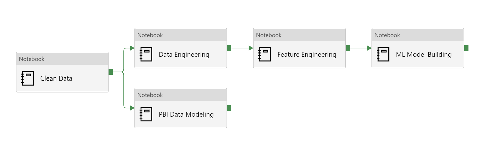
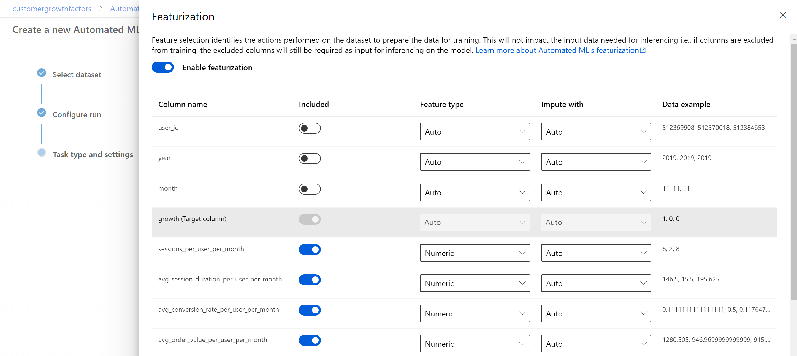

# Deployment Guide  
  
We are currently working on an automated deployment process for this solution accelerator. Until this becomes available, here is the Manual Deployment Guide for deploying this Solution Accelerator.  

## Step 1: Get the data required for this Accelerator 
We are using the data provided by [this Kaggle Open Dataset](https://www.kaggle.com/mkechinov/ecommerce-behavior-data-from-multi-category-store), we suggest to download to an Azure VM, otherwise you will need to download the data locally. You will need the following CSV/datasets (download them):  
        - 2019-Oct.csv  
        - 2019-Nov.csv  
    - These files will be downloaded from a Google drive
    - 2019-Dec.csv.gz (available [here](https://drive.google.com/drive/folders/1Nan8X33H8xrXS5XhCKZmSpClFTCJsSpE))   
    - 2020-Jan.csv.gz (available [here](https://drive.google.com/drive/folders/1Nan8X33H8xrXS5XhCKZmSpClFTCJsSpE))
    - 2020-Feb.csv.gz (available [here](https://drive.google.com/drive/folders/1Nan8X33H8xrXS5XhCKZmSpClFTCJsSpE))  
    - 2020-Mar.csv.gz (available [here](https://drive.google.com/drive/folders/1Nan8X33H8xrXS5XhCKZmSpClFTCJsSpE))
    - 2020-Apr.csv.gz (available [here](https://drive.google.com/drive/folders/1Nan8X33H8xrXS5XhCKZmSpClFTCJsSpE))  
- **Note**: this step may take some time depending on your network connectivity. Consider using an Azure VM to the download and upload of the datasets. Please make sure the VM has at least 30 GB of available storage. 

## Step 2: Storage Account Permissions
In order to read files from your Azure Storage Account from the Synapse workspace, you will need to grant Storage Blob Data Contributor. Follow the steps below to assign Storage Blob Data Contributor to the users.
1. Go to the Azure Data Lake Storage Account created in Step 2
2. Go to the Access Control (IAM)
3. Click "+ Add"
4. Click "Add role assignment"
5. Now click the Role dropdown and select Storage Blob Data Contributor and search for your username and the other user's usernames to be added by using the search bar.

Click "Save" at the bottom.

## Step 3: Upload Data to Synapse Workspace
In this step you will upload the dataset to Azure Data Lake Gen2 so that it can be accessed in the Synapse workspace. File upload is available by downloading the Azure Storage Explorer application or using AzCopy.
1. Open the Microsoft Azure Storage Explorer application
2. Connect to your Azure account
3. In the Explorer, expand your subscription and find the ADLS Gen2 Storage Account that you deployed in Step 2
4. Expand "Blob containers" and click on the container
5. Create a folder named `raw_data`
6. Upload the Kaggle dataset into this folder

### OPTIONAL Step 3.1: Add IP Address to the Synapse Workspace 
* **NOTE**: If you chose to `Allow All Firewall Rule` connections during the resource deployment, skip this step and move to Step 3.2

Before you can upload any assets to the Synapse Workspace you will first need to add your IP address to the Synapse Workspace. 
1. Go to the Azure Synaspe resource you created in Step 1.
2. Navigate to `Firewalls` under `Security` on the left hand side of the page. 
3. At the top click `+ Add client IP`

4. Your IP address should now be visable in the IP list. 

### Step 3.2: Upload Assets
1. Launch Synapse workspace:  
    - Go to the resource page in the portal and click the "Launch Synapse Studio" button
2. Go to "Develop", click the "+", and click Import:  
    - In the demo's repository, go to `Analytics_Deployment\synapse-workspace\notebooks` to select all of the the Spark Notebooks  
3. Click Publish and confirm the assets to be published  
4. Go to the `Manage` tab in the Studio and click on the `Apache Spark pools`  

5. Click `...` on the deployed Spark Pool and select `Packages`
6. Click `Upload` and select `requirements.txt` from the cloned repo.
    - Go to `Analytics_Deployment\synapse-workspace\cluster_config` to get the requirements.txt for upload  
7. Click `Apply`

8. Now the environment should be ready to go for the execution of the scripts  
  
## Step 4: Running of the Notebooks and SQL Scripts  
1. Configure / Fill out the Parameters and then Run the following notebooks and scripts in order:  
    - `1 - Clean Data`  
    - `2 - Data Engineering`  
    - `3 - Feature Engineering`  

### Step 4.1: Train the Model
1. For Azure Synapse Analytics: configure the paramaters and run  `/Azure_Synapse/4 - ML Model Building.ipynb`
2. For Azure Automated ML: Skip to Step 8 and then configure the paramaters and run  `/Azure_Automated_ML/5 - Azure ML Integration.ipynb`
3. After all of these have been run successfully, you will have a Spark-based machine learning model and the top revenue growth factors

## Step 5: Set Up Batch Scoring via Azure Synapse Integration Pipeline
* NOTE: this Batch Scoring Pipeline assumes you have run the `4 - ML Model Building.ipynb` notebook. 

1. In Synapse workspace, go to "Integration", click the "+", and choose Pipeline
2. In the Properties window, change the pipeline name to "Daily Orchestration"
3. Click the "{}" button at the top right corner to open the Code window
4. Copy and paste the contents of `Analytics_Deployment\synapse-workspace\pipelines\Daily Orchestration.json`
5. Click OK to apply. The final pipeline should look like:
    - 
6. Add a scheduled trigger to run the pipeline on a daily basis
7. Click Publish all

## Step 6: Automate the Machine Learning Process with Azure Machine Learning and Deploy the Model to ACI
1. Launch Azure Machine Learning Studio: 
    - Go to the resource page in the portal and click the "Launch studio" button
2. Create a Compute cluster by going to "Compute > Compute clusters > New"
2. Register your data store by going to "Datastores > New Datastore"
    - Entering your Data Lake connection details in the pop-up pane, selecting Azure Blob Storage
3. Register a new dataset by going to "Datasets > Create Dataset > From datastore"
    - In Basic info, enter your dataset name and choose Tabular for dataset type
    - In Datastore selection, click on your previously created datastore and click "Select datastore", then type `transformed_data/ml_data_parquet/**` into the Path box
    - In Settings and preview, verify that the data shows accurately in Parquet format
    - Validate the schema, confirm details, and click "Create"
4. Create an AutoML run by going to "New > Automated ML run"
    - Select your dataset from the list
    - In Configure run, choose "Create new experiment" and enter your experiment details:
    - 
    - In Task type and settings, select "Classification"
    - Click to "View additional configuration settings", change Primary metric to "AUC weighted", and set the "Training job time (hours)" to "0.25" and Save
        - **Note**: setting the "Training job time (hours)" to '0.25" will decrease the experiment time and may not give the best performing mode
    - Click to "View featurization settings" and ensure that the `user_id`, `year`, and `month` columns are not included in training, and that feature types are appropriately selected
    - 
    - Click Finish to start the AutoML run
5. When the run has completed, go to `Expariments`, click on the `Run ID`, under `Best Model Summary` and click on the `Algorithm name` and click `Details`, Save this Run ID for `/Azure_Automated_ML/5 - Azure ML Integration.ipynb`
6. Deploy your model to ACI using the "Deploy" button 
    - Enter model name, select Azure Container Instance as the compute type, then click Deploy
7. Once deployed, you can view the REST endpoint in the "Endpoints" tab

## Step 7: Connect Power BI to Azure Machine Learning and Deploy to the Synapse Workspace
1. Launch Synapse workspace and run the following notebooks to export the results of the AutoML model and create the data model for the Power BI report:
    1. `6 - PBI Data Model` 
2. Download [Power BI Desktop](https://www.microsoft.com/en-us/download/details.aspx?id=58494)
3. Create a new workspace in [Power BI Service](https://app.powerbi.com/)
4. Enable AI Insights with Power BI:
    - In the new workspace, click on "New > Dataflow" to create a PBI Dataflow
    - Select "Add new entities" and choose Azure Data Lake Gen2 as your data source, then enter your connection URL as `https://[adls_name].dfs.core.windows.net/`
    - Click to Transform Data and filter Folder Path to `https://[adls_name].dfs.core.windows.net/[container_name]/transformed_data/ml_data_parquet/` to connect to the dataset for ML modeling
    - Click "Remove rows" and click "Remove top rows" 
        - enter `1` and select "OK"
    - Click the two arrows next to the "Content" column to expand and combine all parquet files
    - Apply your AutoML model by clicking the "AI Insights" button
    - 
    - Select your deployed model and map the relevant columns
    - 
    - Once applied, you will see a new column with the AutoML score. Save your entity and dataflow
5. Build report visuals in Power BI:
    - In the demo's repository, go to `Analytics_Deployment\synapse-workspace\reports` and open [Customer_Growth_Factors_PBI.pbix](../Analytics_Deployment/synapse-workspace/reports/Customer_Growth_Facters_PBI.pbix) in Power BI Desktop
    - Connect to the Data Lake via "Get Data > Azure > Azure Data Lake Gen2" and filtering to the relevant tables by URL. You will need a new dataset for each folder within `https://[adls_name].dfs.core.windows.net/[container_name]/reporting/`
    - Connect to the Dataflow via "Get Data > PowerBI dataflows" and selecting your dataflow
6. Deploy your report to the Synapse workspace:
    - Launch Synapse workspace and go to "Navigate > Linked services"
        - Click "New" and search for Power BI, then enter your Power BI workspace details
        - Now your workspace is linked within Azure Synapse
    - In Power BI Desktop, click "Publish" to deploy your report, and select the same workspace
7. Now you can view and edit your report from the Synapse workspace